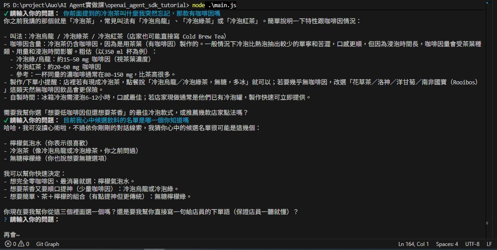

<!--
 * @Author: ChiaEnKang
 * @Date: 2026-06-18 10:17:29
 * @LastEditors: ChiaEnKang
 * @LastEditTime: 2026-06-18 11:52:35
-->
# OpenAI Agent SDK Tutorial

A hands-on tutorial for building AI agents with the OpenAI Agent SDK.

## 專案情境

本專案示範如何建立一個「手搖飲推薦顧問」聊天助手。助手會根據使用者的口味、天氣、健康需求、咖啡因接受度，以及飲品製作時間，推薦合適的手搖飲、甜度、冰塊與配料搭配。

## CMD 對話紀錄

以下是使用者在 CMD 中與手搖飲推薦助手的對答紀錄：

### 實際執行畫面截圖(示意，只有截最後兩次對話內容)

### 實際對話逐字內容
### 使用者

天氣好熱喔，現在適合喝什麼飲料

### 助手

夏天超適合喝清爽又解渴的！給你三款好喝又消暑的選擇。

1. 檸檬綠茶

- 建議甜度：三分糖或微糖
- 建議冰塊：多冰或正常冰
- 推薦配料：新鮮檸檬片，或不加配料保留清爽感
- 推薦理由：酸甜提神、茶香清爽，熱天喝不膩
- 熱量 / 製作時間提醒：約 10-40 kcal，製作約 1-2 分鐘，咖啡因中等

2. 百香果鮮果茶

- 建議甜度：三分糖或半糖
- 建議冰塊：正常冰
- 推薦配料：愛玉或茶凍，想有飽足感可加小珍珠
- 推薦理由：果香濃、口感清爽，適合夏天想喝水果風味的人
- 熱量 / 製作時間提醒：約 40-150 kcal，製作約 2-4 分鐘

3. 檸檬氣泡飲

- 建議甜度：少糖或無糖
- 建議冰塊：多冰
- 推薦配料：薄荷葉或檸檬片
- 推薦理由：氣泡感最消暑，喝起來清爽解膩
- 熱量 / 製作時間提醒：約 0-80 kcal，製作約 1-2 分鐘

### 使用者

我想要無糖的選項，這些有糖的會越喝越渴

### 助手

好啊！既然你想要無糖、又不想越喝越渴，我幫你挑了三款清爽又零糖的手搖飲。

1. 冷泡烏龍

- 建議甜度：無糖
- 建議冰塊：多冰
- 推薦配料：薄荷葉或一片新鮮檸檬
- 推薦理由：茶香柔和、不易苦澀，清爽又有提神效果
- 熱量 / 製作時間提醒：約 0 kcal，製作約 1-2 分鐘，咖啡因中等

2. 檸檬氣泡水

- 建議甜度：無糖
- 建議冰塊：多冰
- 推薦配料：多片新鮮檸檬，也可加少許薄荷
- 推薦理由：無茶葉、無咖啡因，氣泡感醒胃又消暑
- 熱量 / 製作時間提醒：約 0 kcal，製作約 30-60 秒

3. 無糖檸檬綠

- 建議甜度：無糖
- 建議冰塊：正常冰或多冰
- 推薦配料：一到兩片新鮮檸檬
- 推薦理由：綠茶清爽，檸檬增加酸香，比一般含糖果茶更低負擔
- 熱量 / 製作時間提醒：約 0-5 kcal，製作約 1-2 分鐘，含少量咖啡因

小提醒：點餐時可以說「無糖、不要糖漿、不要果糖」，避免店家使用預調甜味基底。

### 使用者

檸檬氣泡水好像是個不錯的推薦，但是似乎沒有很多飲料店有

### 助手

檸檬氣泡水確實不是每間手搖店都有，因為店家叫法不同，有些也會預設加糖。可以用以下方式下單或替代：

- 常見名稱：檸檬蘇打、檸檬氣泡、檸檬氣泡水、檸檬汽水
- 下單說法：「一杯檸檬蘇打，無糖，檸檬多一點，多冰，請用蘇打水。」
- 注意事項：要特別強調「不要糖漿、不要果糖、只要檸檬原汁加氣泡水」

如果店家沒有純檸檬氣泡水，可以改點：

- 氣泡綠茶，無糖加檸檬
- 冷泡茶加氣泡水
- 檸檬原汁加氣泡水，不加糖漿

在家也可以快速 DIY：冰塊、氣泡水、半顆檸檬、少許海鹽或薄荷，混合後就能完成。製作時間約 1-3 分鐘，熱量接近 0 kcal。

### 使用者

在家自己做的話，如果我沒有薄荷葉有其他替代方案嗎 另外用外面賣的檸檬汁可以嗎

### 助手

沒薄荷也沒關係，可以用家裡常見食材替代。

薄荷替代品：

- 小黃瓜片：清爽度高，很適合夏天
- 檸檬皮或檸檬皮屑：增加香氣
- 羅勒或九層塔：帶草本香氣
- 迷迭香：香氣較強，適合想要特殊風味的人
- 橙片或青檸片：讓風味更圓潤

外面賣的檸檬汁也可以使用，但建議選擇標示為 100% 檸檬汁、無糖、無額外添加糖漿的產品。瓶裝檸檬汁通常酸味較直接、香氣較弱，所以可以搭配檸檬皮屑或新鮮檸檬片提升香氣。

建議比例：

- 300-350 ml 氣泡水
- 瓶裝檸檬汁 10-15 ml 起跳
- 依照酸度再慢慢增加

### 使用者

你前面提到的冷泡茶叫什麼我突然忘記，那款有咖啡因嗎

### 助手

前面提到的是「冷泡茶」，常見名稱有冷泡烏龍、冷泡綠茶或冷泡紅茶。

冷泡茶仍然含有咖啡因，因為它是用茶葉製作的。一般來說冷泡茶口感比熱泡茶更順、不易苦澀，但咖啡因含量仍會受到茶葉種類、用量與浸泡時間影響。

大約咖啡因含量：

- 冷泡綠茶 / 冷泡烏龍：約 15-50 mg
- 冷泡紅茶：約 20-60 mg
- 一杯同容量咖啡：約 80-150 mg

如果想要幾乎無咖啡因，可以選花草茶、洛神茶、洋甘菊茶或南非國寶茶。

### 使用者

目前我心中候選飲料的名單是哪一個你知道嗎

### 助手

依照剛剛的對話線索，你心中的候選名單很可能是：

- 檸檬氣泡水：你表示很喜歡，無糖、無咖啡因、最消暑
- 冷泡茶：像冷泡烏龍或冷泡綠茶，有茶香但含少量咖啡因
- 無糖檸檬綠：清爽、簡單，有茶感也有檸檬酸香

如果要快速決定：

- 想完全零咖啡因、最消暑：檸檬氣泡水
- 想要茶香又順口提神：冷泡烏龍或冷泡綠
- 想要傳統茶感加檸檬清爽感：無糖檸檬綠
