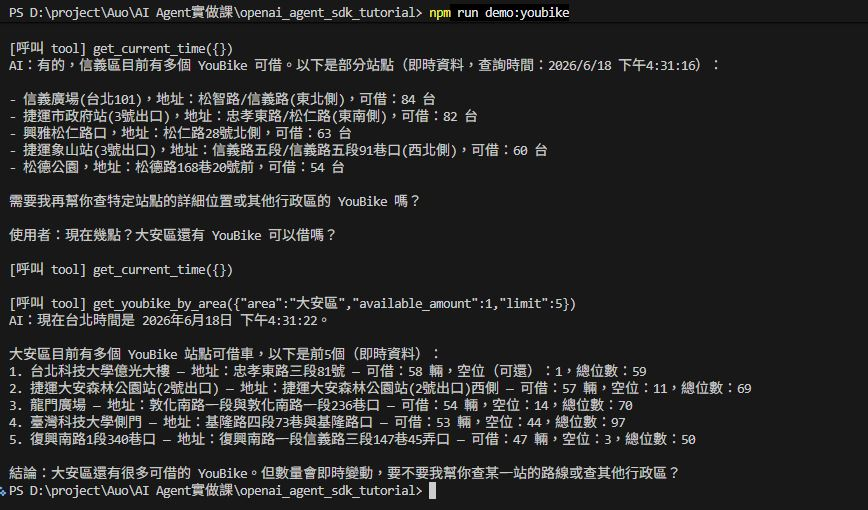

<!--
 * @Author: ChiaEnKang
 * @Date: 2026-06-18 10:17:29
 * @LastEditors: ChiaEnKang
 * @LastEditTime: 2026-06-18 16:35:09
-->
# OpenAI Agent SDK Tutorial

A hands-on tutorial for building AI agents with the OpenAI Agent SDK.

## 作業 4：整合 YouBike 與時間工具

本作業參考老師提供的 Tool Calling 範例，整合「目前時間」與「YouBike 行政區查詢」兩個工具，建立一個可以回答台灣時間與台北市 YouBike 可借站點的助理。

注意：YouBike 工具使用台北市開放資料，查詢時要輸入行政區名稱，例如 `大安區`、`信義區`，不要只輸入 `台北市`。

### 檔案說明

- `function_call.js`：主程式，註冊工具並執行三組測試對話
- `tools/current_time.js`：取得目前台灣時間
- `tools/youbike.js`：依台北市行政區查詢可租借的 YouBike 站點
- `tools/index.js`：工具註冊匯出
- `utils/func-tool.js`：將工具轉成 OpenAI Function Calling 格式
- `utils/spinner.js`：命令列等待動畫

### 執行方式

```bash
npm run demo:youbike
```

或直接執行：

```bash
node function_call.js
```

### 執行畫面截圖



### 測試結果

測試 1：

```text
現在幾點？
```

呼叫工具：

```text
[呼叫 tool] get_current_time({})
```

測試 2：

```text
信義區有 YouBike 可以借嗎？
```

呼叫工具：

```text
[呼叫 tool] get_youbike_by_area({"area":"信義區","available_amount":1,"limit":10})
```

測試 3：

```text
現在幾點？大安區還有 YouBike 可以借嗎？
```

呼叫工具：

```text
[呼叫 tool] get_current_time({})
[呼叫 tool] get_youbike_by_area({"area":"大安區","available_amount":1,"limit":5})
```

### 結果說明

三個測試問題都能正確觸發工具。單純詢問時間時會呼叫 `get_current_time`；詢問行政區 YouBike 時會呼叫 `get_youbike_by_area`；同時詢問時間與 YouBike 時，AI 會在同一輪對話中呼叫兩個工具。

## 作業 3：建立迷你知識庫

本作業使用 OpenAI Embeddings API 與 Qdrant Cloud 建立一個小型向量知識庫，主題選擇「開發工具介紹」。

知識庫包含 5 筆資料：

- VS Code：程式碼編輯器
- Git：版本控制工具
- Docker：容器化工具
- Postman：API 測試工具
- npm：Node.js 套件管理工具

### 檔案說明

- `data/dev-tools.js`：5 筆知識庫內容
- `lib/openai.js`：OpenAI client 設定
- `lib/qdrant.js`：Qdrant client、embedding 與搜尋函式
- `scripts/init-knowledge.js`：初始化 Qdrant collection 並寫入向量
- `scripts/search-knowledge.js`：使用 3 種不同問法測試搜尋結果

### 執行方式

先建立知識庫：

```bash
npm run init:knowledge
```

再執行搜尋測試：

```bash
npm run search:knowledge
```

### 測試結果

問題 1：

```text
我想寫程式和管理專案檔案，應該用什麼工具？
```

搜尋結果第一名：

```text
VS Code (程式碼編輯器)
分數：0.487
```

問題 2：

```text
哪個工具可以幫我記錄程式碼版本，並把作業推到 GitHub？
```

搜尋結果第一名：

```text
Git (版本控制工具)
分數：0.712
```

問題 3：

```text
我要測試後端 API 回傳資料正不正確，適合用哪個工具？
```

搜尋結果第一名：

```text
Postman (API 測試工具)
分數：0.619
```

### 結果說明

三個測試問題都能找到語意最相關的開發工具，表示 Embeddings 產生的向量可以用來做基本語意搜尋。即使問題沒有完全使用知識庫中的原句，也能依照語意找到合適結果。
