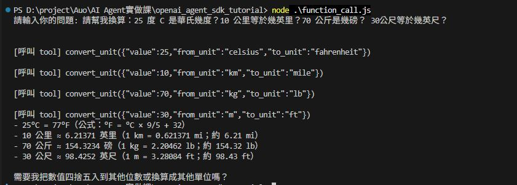

<!--
 * @Author: ChiaEnKang
 * @Date: 2026-06-18 10:17:29
 * @LastEditors: ChiaEnKang
 * @LastEditTime: 2026-06-18 13:43:31
-->
# OpenAI Agent SDK Tutorial

A hands-on tutorial for building AI agents with the OpenAI Agent SDK.

## 作業 2：Function Calling 單位換算工具

本專案新增一個 `convert_unit` Function Calling 工具，讓 AI 可以透過自然語言判斷使用者想做的單位換算，並呼叫工具取得正確結果。

目前支援的換算組合：

- 攝氏 ↔ 華氏
- 公里 ↔ 英里
- 公斤 ↔ 磅
- 公尺 ↔ 英尺

### 執行畫面截圖



### CMD 對話紀錄

使用者在 CMD 中輸入：

```text
請幫我換算：25 度 C 是華氏幾度？10 公里等於幾英里？70 公斤是幾磅？30 公尺等於幾英尺？
```

AI 依照自然語言內容呼叫 `convert_unit` 工具：

```text
[呼叫 tool] convert_unit({"value":25,"from_unit":"celsius","to_unit":"fahrenheit"})

[呼叫 tool] convert_unit({"value":10,"from_unit":"km","to_unit":"mile"})

[呼叫 tool] convert_unit({"value":70,"from_unit":"kg","to_unit":"lb"})

[呼叫 tool] convert_unit({"value":30,"from_unit":"m","to_unit":"ft"})
```

工具回傳後，AI 整理成使用者容易理解的答案：

```text
- 25°C = 77°F
- 10 公里 ≈ 6.21371 英里，約 6.21 mi
- 70 公斤 ≈ 154.3234 磅，約 154.32 lb
- 30 公尺 ≈ 98.4252 英尺，約 98.43 ft
```
